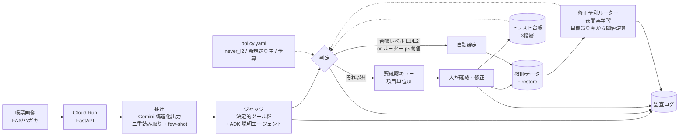

# アーキテクチャ



## 責務

| 層 | 場所 | 役割 |
|---|---|---|
| 抽出 | `app/extract/` | Gemini responseSchema で項目ごとに value/confidence/evidence。variant で別プロンプト（二重読み取り）。過去確定例を few-shot 注入 |
| ジャッジ | `app/judge/` | 履歴ゼロでも動く決定的検証（郵便番号↔住所、商品マスタ、電話桁、カナ、数量）＋二重読み取り一致。ADK エージェントは要確認理由の説明係 |
| 台帳 | `app/trust/` | 項目種別 × {送り主, 様式, 全体} の3階層。承認 streak で L0→L1→L2 昇格、修正で即降格。`policy.yaml` が上限 |
| 学習 | `app/learn/` | 「人が直すか」を予測する勾配ブースティング。検証データで目標誤り率以下になる閾値を逆算。教師データは確定時に自動生成 |
| 保存 | `app/store/` | Memory（ローカル）／Firestore + Cloud Storage（本番） |
| 監査 | `AuditEvent` | 抽出・判定・確定・昇降格・再学習を全て記録。後から「なぜ自動確定したか」を再現できる |

## 判定ロジック（`Pipeline._decide`）

1. 検証に FAIL があれば **要確認**（学習より安全側を優先）
2. ルーターが学習済みで `p < threshold` かつ台帳が L1 以上なら **自動**
3. ルーターが `p ≥ threshold` なら **要確認**
4. ルーター未学習のとき: L2 → 自動、L1 かつ検証全合格＋二重読み取り一致 → 自動、それ以外 → 要確認

## VLM OCR の4つの落とし穴への対応

| 落とし穴 | 一般的な対策 | 本作の対応 |
|---|---|---|
| ① 精度は100%ではない | 重要書類は人が確認 | 人の確認を「全部」から「例外」へ。台帳＋学習ルーターで自動確定を広げ、監査サンプリングで自動確定の誤り率を**実測**して目標（0.5%）以下に保つ |
| ② ハルシネーション（読めない所を埋める） | 自信度スコア＋突合＋人 | 自己申告の自信度は使わない。**空欄検知**（欄のインク量 vs 値。枠線・縦筋は run 長で除外）、**根拠整合**（value vs evidence）、二重読み取りの一致、外部照合（郵便番号↔住所・商品マスタ）。評価セットに空欄を混ぜ「創作率」「検知率」を計測 |
| ③ 機密書類の置き場所 | クラウドは画像が外へ。機密はオンプレ | **プロファイル切替**。lean: 機密欄をマスクしてから送信＋外部送信を監査ログに記録＋保持期限（Firestore TTL）。secure: Gemma（Ollama 互換 API、VPC 内/オンプレ）で読み、画像を外に出さない。抽出器インターフェースは共通 |
| ④ コストと使い分け | 定型は従来OCR、非定型はVLM | 台帳 L2 で二重読み取りを省略、予算上限をポリシーで宣言。Flash 系を既定にし、判断が割れた項目だけ高精度モデルへ昇格する設計（拡張点） |

## 運用プロファイル

```yaml
profile: lean     # 現場向け: Gemini Flash、マスク送信、TTL
profile: secure   # 高機密向け: Gemma を VPC 内 / オンプレで実行（OLLAMA_HOST）。画像は外に出ない
```

抽出器（`app/extract/`）だけが差し替わり、ジャッジ・台帳・学習・UI は共通。ハッカソン提出は lean で動作、secure は継ぎ目をコードと設計図で示す。

## セキュリティ

- 全ルートに HTTP Basic 認証（資格情報は Secret Manager）。`/health` のみ公開
- 画像は PNG/JPEG のみ・10MB 上限
- Gemini API キー・認証情報は Secret Manager。サービスアカウントは secretAccessor + datastore.user のみ
- 抽出値・画像に保持期限（`retention_days`）。Firestore TTL で自動削除。監査ログは保持
- 帳票の値をアプリログに出さない
- **実運用の注意**: Gemini API（AI Studio キー）は処理リージョンを指定できない。個人情報を扱う本番は Vertex AI（リージョン固定・企業向け規約）か secure プロファイルへ

## ガバナンス

- 人が `policy.yaml` で宣言した範囲の外ではエージェントは自律しない（never_l2、新規送り主必須確認、予算上限、監査サンプリング）
- 自動確定の誤りは、後日の修正で `was_auto=True and corrected=True` として検出され、台帳の即降格と再学習に反映される
