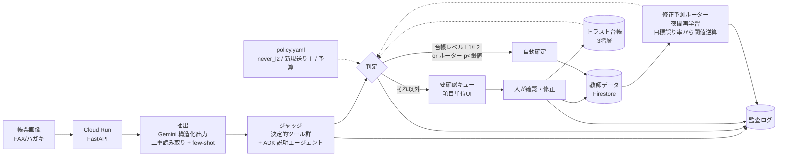

# アーキテクチャ

## 責務

| 層 | 場所 | 役割 |
|---|---|---|
| 抽出 | `app/extract/` | Gemini responseSchema で項目ごとに value/confidence/evidence。variant で別プロンプト（二重読み取り）。過去確定例を few-shot 注入 |
| ジャッジ | `app/judge/` | 履歴ゼロでも動く決定的検証（郵便番号↔住所、商品マスタ、電話桁、カナ、数量）＋二重読み取り一致。ADK エージェントは要確認理由の説明係 |
| 台帳 | `app/trust/` | 項目種別 × {送り主, 様式, 全体} の3階層。承認 streak で L0→L1→L2 昇格、修正で即降格。`policy.yaml` が上限 |
| 学習 | `app/learn/` | 「人が直すか」を予測する勾配ブースティング。検証データで目標誤り率以下になる閾値を逆算。教師データは確定時に自動生成 |
| 保存 | `app/store/` | Memory（ローカル）／Firestore + Cloud Storage（本番） |
| 監査 | `AuditEvent` | 抽出・判定・確定・昇降格・再学習を全て記録。後から「なぜ自動確定したか」を再現できる |

## 判定ロジック（`Pipeline._decide`）

1. 検証に FAIL があれば **要確認**（学習より安全側を優先）
2. ルーターが学習済みで `p < threshold` かつ台帳が L1 以上なら **自動**
3. ルーターが `p ≥ threshold` なら **要確認**
4. ルーター未学習のとき: L2 → 自動、L1 かつ検証全合格＋二重読み取り一致 → 自動、それ以外 → 要確認

## ガバナンス

- 人が `policy.yaml` で宣言した範囲の外ではエージェントは自律しない（never_l2、新規送り主必須確認、予算上限、監査サンプリング）
- 自動確定の誤りは、後日の修正で `was_auto=True and corrected=True` として検出され、台帳の即降格と再学習に反映される
